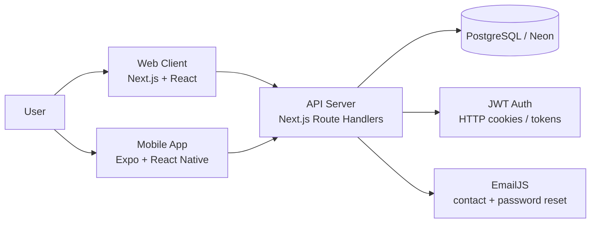
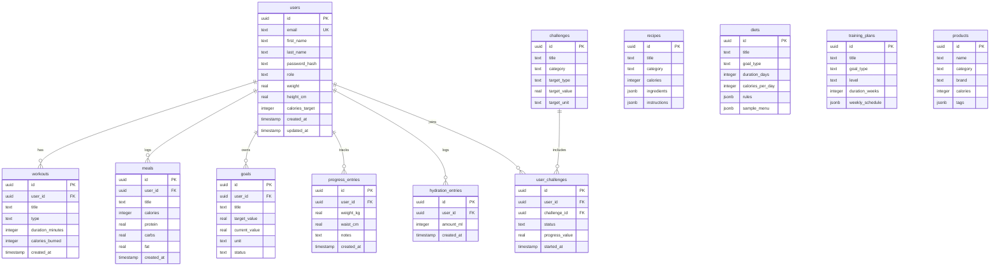

# Fit Life

Fit Life is a full-stack fitness and nutrition tracking application for Bulgarian-speaking users. It helps users register and manage a profile, track meals and calories, log weight and body progress, follow workouts and training plans, explore recipes and diets, join challenges, track hydration, and browse nutrition products.

The project contains a web app, a mobile app, and an API server backed by a PostgreSQL database.

```
fit-life-project/
+-- server/   API - Next.js + PostgreSQL + Drizzle ORM
+-- client/   Web app - Next.js + React
+-- mobile/   Mobile app - Expo + React Native
```

## Project Description

Fit Life is designed around everyday health tracking:

- Visitors can view public pages such as home, about, contact, recipes, diets, training plans, challenges, products, and legal pages.
- Registered users can sign in, edit their profile, set nutrition and fitness goals, log meals, hydration, workouts, and progress entries.
- Users can browse structured fitness content such as recipes, diet guides, training plans, products, and challenges.
- Admin users can access admin-only routes for user and application management.
- The mobile app gives users a phone-first experience for the same core fitness workflows.

All visible application text is intended to be in Bulgarian.

## Architecture

### High-Level System



### Front End

The web client lives in `client/` and is built with Next.js 15, React 19, TypeScript, and the Next.js App Router. It contains public pages, authenticated dashboard pages, admin-only pages, API service wrappers, reusable hooks, shared layout components, and Tailwind CSS installed as a dependency.

### Mobile App

The mobile app lives in `mobile/` and is built with Expo, React Native, TypeScript, and Expo Router. It uses file-based routes under `mobile/app/`, shared UI primitives under `mobile/src/components/`, service wrappers under `mobile/src/services/`, and a centralized dark theme in `mobile/src/theme.ts`.

### Back End

The API server lives in `server/` and uses Next.js route handlers under `server/app/api/`. It handles authentication, profiles, meals, workouts, goals, progress, hydration, recipes, diets, training plans, products, challenges, user challenges, contact messages, and admin data.

### Database

The database is PostgreSQL, commonly run through Neon. Drizzle ORM defines the schema in `server/db/schema.ts`, migrations are stored under `server/drizzle/`, and seed scripts live in `server/db/`.

### API Communication

- Web client API base URL: `client/src/services/apiConfig.ts`
- Mobile API base URL: `mobile/src/config/app.config.ts`
- Local API server: `http://localhost:3001`
- Production API server: `https://fit-life-api.netlify.app`

The clients call the API through feature-specific service files such as `authApi`, `profileApi`, `recipesApi`, `dietsApi`, `productsApi`, `hydrationApi`, and related modules.

## Database Schema Design

Main tables and relationships:



Content tables such as `recipes`, `diets`, `training_plans`, and `products` are global catalog data. User-owned tables reference `users.id` and are deleted when the user is deleted.

## Repository Structure

```text
fit-life-project/
+-- README.md                 Project overview and setup guide
+-- DEPLOYMENT.md             Deployment notes
+-- mobile-app-qr.svg         QR code for Android APK download
+-- client/                   Web frontend
|   +-- src/app/              Next.js App Router route folders
|   +-- src/views/            Feature view implementations
|   +-- src/layout/           Shared layout components
|   +-- src/components/       Shared route guards and UI components
|   +-- src/context/          Authentication context
|   +-- src/hooks/            Data and local state hooks
|   +-- src/services/         API clients for backend endpoints
|   +-- public/               Static public assets and global CSS
+-- mobile/                   Expo mobile app
|   +-- app/                  Expo Router screens and route groups
|   +-- src/components/       Shared React Native UI primitives
|   +-- src/context/          Authentication context
|   +-- src/services/         API service wrappers
|   +-- src/types/            Shared TypeScript types
|   +-- src/theme.ts          Dark theme tokens
+-- server/                   Backend API
    +-- app/api/              Next.js API route handlers
    +-- db/schema.ts          Drizzle database schema
    +-- db/seed*.ts           Seed scripts
    +-- drizzle/              Generated migrations
    +-- lib/                  Auth, validation, repositories
    +-- scripts/backups/      Database backup scripts
```

## Local Development Setup

### Requirements

- Node.js 18+
- PostgreSQL / Neon database
- Expo Go on your phone (optional, for physical device testing)

### Clone the Repository

```powershell
git clone <repository-url>
cd fit-life-project
```

### 1. Server

```powershell
cd server
npm install
```

Create `server/.env` and fill in your values:

```
JWT_SECRET=
DATABASE_URL=
CLIENT_URL=
SERVER_URL=
EMAILJS_SERVICE_ID=
EMAILJS_TEMPLATE_ID=
EMAILJS_PUBLIC_KEY=
EMAILJS_ACCESS_TOKEN=
CONTACT_EMAILJS_SERVICE_ID=
CONTACT_EMAILJS_TEMPLATE_ID=
CONTACT_EMAILJS_PUBLIC_KEY=
CONTACT_EMAILJS_ACCESS_TOKEN=
CONTACT_TO_EMAIL=
R2_ACCOUNT_ID=
R2_BUCKET_NAME=
R2_ACCESS_KEY_ID=
R2_SECRET_ACCESS_KEY=
R2_PUBLIC_URL=
```

Prepare the database:

```powershell
npm run db:migrate
npm run db:seed
```

Optional feature-specific seed scripts:

```powershell
npm run db:seed:recipes
npm run db:seed:diets
npm run db:seed:training-plans
npm run db:seed:products
npm run db:seed:challenges
```

Start:

```powershell
npm run dev
```

Runs on `http://localhost:3001`

### 2. Web Client

Create `client/.env`:

```
NEXT_PUBLIC_API_BASE_URL=http://localhost:3001
```

```powershell
cd client
npm install
npm run dev
```

Runs on `http://localhost:3000` by default.

### Test Accounts

Use these accounts when testing authentication flows:

| Role | Email | Password |
|---|---|---|
| User | `peter@abv.bg` | `asd123asd` |
| Admin | `admin@fitlife.bg` | `admin1234` |

The "Forgot Password" functionality works with real email delivery. To test it properly, register with or use an existing email address that you can access, then open the password reset link from that inbox.

### 3. Mobile App

```powershell
cd mobile
npm install
npm run start
```

Press `a` for Android emulator, `i` for iOS simulator, `w` for browser, or scan the QR code with Expo Go.

The app connects to the local API during development and to the production API in production builds.

---

## Scalability & Performance

### Server-side pagination

Every catalog endpoint (`/api/recipes`, `/api/products`, `/api/training-plans`,
`/api/diets`, `/api/challenges`) supports `?page=` and `?limit=` query parameters.
Responses include `{ items, page, limit, total, totalPages }` so clients can
implement infinite scroll or numbered pages without loading the full dataset.

### 10,000-row catalog seed

The script `db/seed-catalog-load.ts` seeds at least **10,000 rows** into
`recipes`, `products`, and `training_plans` by generating variations from a curated
base dataset. This provides realistic pagination, search, and index performance
for evaluation and load testing.

Run it with:

```powershell
cd server
npm run db:seed:catalog-load
```

Or use the combined command that runs all seeds in order:

```powershell
npm run db:seed:full
```

### Database indexes

Migration `0013_catalog_performance_indexes` adds:

| Table | Index type | Columns |
|---|---|---|
| `recipes` | B-tree | `(category, difficulty)`, `created_at DESC` |
| `training_plans` | B-tree | `(goal_type, level)`, `level`, `created_at DESC` |
| `products` | B-tree | `(category, created_at DESC)`, `(category, protein DESC)` |
| `recipes` | GIN / trgm | `title`, `description` — full-text search |
| `products` | GIN / trgm | `name`, `description`, `brand` — full-text search |
| `training_plans` | GIN / trgm | `title`, `description` — full-text search |

GIN / trgm indexes require the `pg_trgm` extension (enabled by default on Neon).

### Drizzle ORM repositories

All database access goes through typed repository modules in `server/lib/repositories/`.
Each repository uses Drizzle's query builder, keeping SQL generation structured and
preventing raw-string injection vulnerabilities.

### Neon serverless PostgreSQL

The backend targets [Neon](https://neon.tech/), a serverless PostgreSQL provider.
Neon scales compute to zero when idle and scales out automatically under load,
which aligns with the serverless deployment model on Netlify.

### Cloudflare R2 object storage

User avatar images are stored in a Cloudflare R2 bucket, keeping binary assets
out of the database and off the application server. R2 serves files via a public CDN URL.

---

## Hosted

- Web: https://fitlife-com.netlify.app/
- Android APK: https://expo.dev/accounts/martin13s18/projects/fit-life/builds/4d49c3a1-48dd-484b-bded-2e005690cbb3

## Download the Mobile App

Scan this QR code to download the Android APK directly to your phone.


